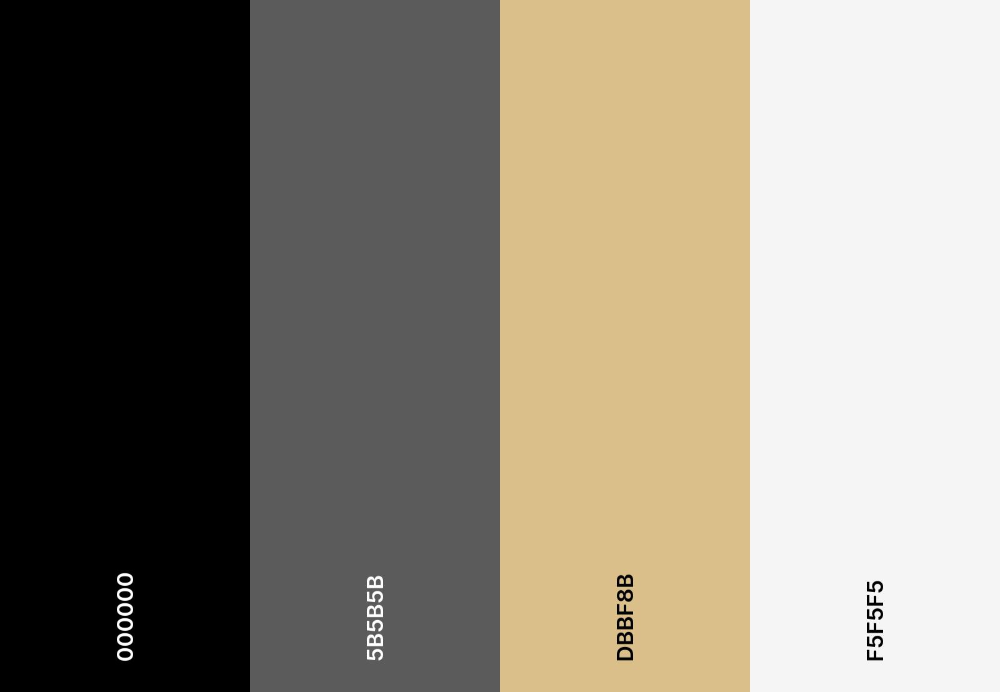
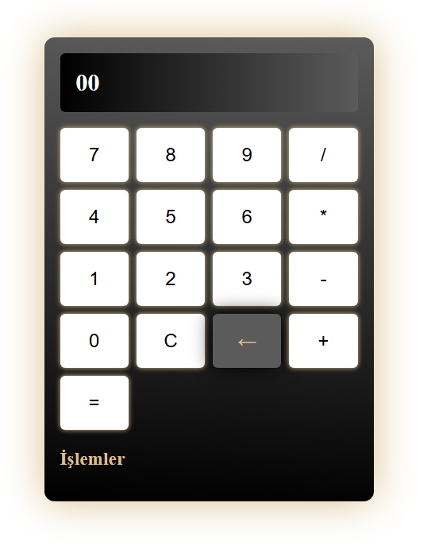
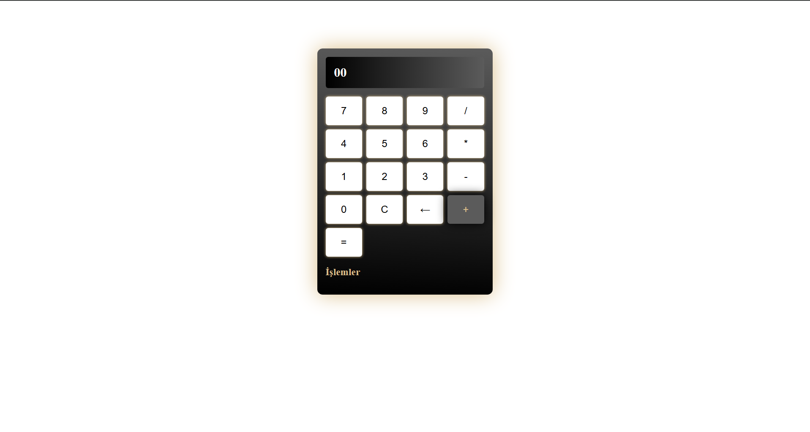
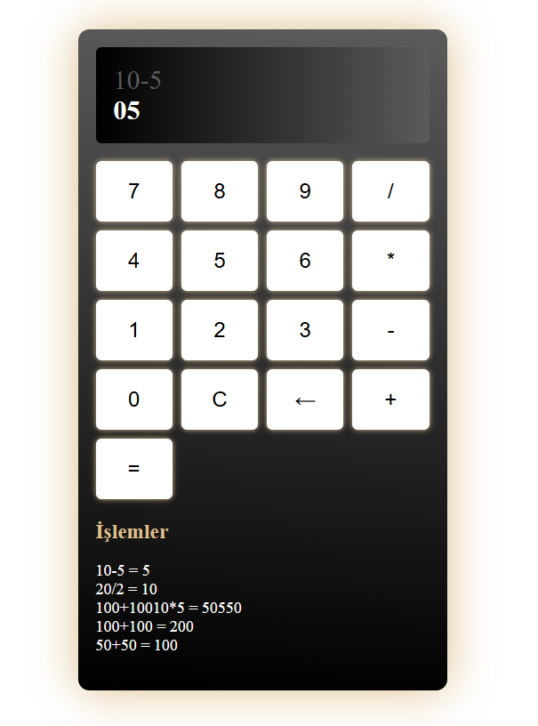

#  Angular Calculator

This is a calculator application built with Angular that is responsive and modular. It supports basic arithmetic operations (addition, subtraction, multiplication, division), stores the last 5 operations, and uses a custom pipe to format results with two digits.

---

##  Features

✅ Basic 4 operations (+, −, ×, ÷)  
✅ Functional C (clear), ← (backspace), and = (equals) buttons  
✅ Stores last 5 operations using a service  
✅ Custom Pipe for two-digit number formatting (e.g., 9 → 09)  
✅ Responsive, clean design using pure CSS  

---

##  Technologies Used

- Angular 16
- TypeScript
- CSS
- RxJS 
- Angular CLI

---

## Project Structure

```sh
src/
├── app/
│   ├── components/
│   │   └── calculator/
│   │       ├── calculator.component.ts
│   │       ├── calculator.component.html
│   │       └── calculator.component.css
│   ├── services/
│   │   └── history.service.ts
│   ├── pipes/
│   │   └── double-digit.pipe.ts
│   ├── app.component.ts
│   ├── app.component.html
│   └── app.module.ts

```

##  Installation & Running

### 1. Clone the project:

```bash
git clone https://github.com/yourUsername/angular-calculator.git
cd angular-calculator
```


### 2. Install dependencies:

```bash
npm install
```

### 3. Run the project:

```bash
ng serve
```

Then open in your browser:  
➡️ `http://localhost:4200`

---

## Color scheme



---
## Screenshots





